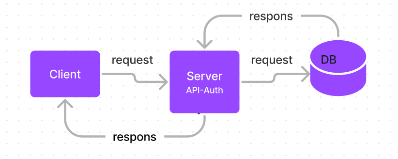

# auth-api
[gitHub](https://github.com/alsatarysamah/auth-api)

[Action](https://github.com/alsatarysamah/auth-api/actions)

[PR](https://github.com/alsatarysamah/auth-api/pull/1)

[heroku](https://samah-api-auth.herokuapp.com/)

its a project that is designed to handle user registration and sign in using Basic, Bearer, or OAuth along with a custom “authorization” module that will grant/deny users access to the server based on their role or permissions level.

# UML
.png)

# WRRC

## Routes

POST /signup to create a user

POST /signin to login a user and receive a token

GET /secret should require a valid bearer token

GET /users should require a valid token and “delete” permissions

## food V1 routes

1-POST /api/v1/food adds an item to the DB and returns an object with the added item

2-GET /api/v1/food returns a list of :model items

3-GET /api/v1/food/ID returns a single item by ID

4-PUT /api/v1/food/ID returns a single, updated item by ID

5-DELETE /api/v1/food/ID returns an empty object. 

## food V2 routes

1-POST /api/v2/food with a bearer token that has create permissions adds an item to the DB and returns an object with the added item

2-GET /api/v2/food with a bearer token that has read permissions returns a list of :model items

3-GET /api/v2/food/ID with a bearer token that has read permissions returns a single item by ID

4-PUT /api/v2/food/ID with a bearer token that has update permissions returns a single, updated item by ID

5-DELETE /api/v2/food/ID with a bearer token that has delete permissions returns an empty object. Subsequent GET for the same ID should result in nothing found

